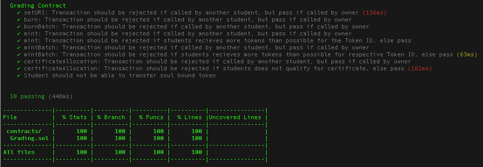

# Grading for Programmable Society

This project was written within the scope of the [DD2485 Programmable Society course](https://github.com/KTH/programmable-society) at KTH Royal Institute of Technology in Stockholm, Sweden. The assignment was to create a smart contract to be presented during the Smart Contract Grand Oral, on December 18, 2023. 

We chose to develop a smart contract for storing student grades from the DD2485 course assignments on blockchain. Whenever a student presents an assignment, their grade for that assignment is reported to Canvas LMS. Then, every 6 hours, a GitHub Action will run a Python script. The Python script fetches grading data using `canvasapi` and mints an assignment-token for every assignment that has been graded with `complete` since the last GitHub Action workflow run. Moreover, if a student was misgraded, i.e., first recieved `complete` and then `incomplete` during the next workflow run for some reason, the student's assignment-token is burnt. The interaction with the smart contract is made possible by using `web3.py` and connecting to blockchain thorugh a Chainstack node. 

## Course Grading Policy

For the 2023 iteration of the DD2485 Programmable Society, each student has to recieve `complete` in Canvas for three mandatory assignments: `Presentations`, `Smart Contract Protocol` and `Demos`. This will give the student a final grade of E. Moreover, there are four optional assignments: `Open Source Contributions`, `Feedback`, `Essays` and `Questions`. Completing each of these raises the student's grade with one step, up to the maximum grade of A.

## Python Script

The Python Script `scripts/Grading.py` first connects to the Ethereum Sepolia Testnet using a Chainstack node. Thereafter, `PyGithub` is used to get the timestamp of the last GitHub Action workflow run. We then use `canvasapi` to iterate thorugh the assignment submissions for a student. If a grade change for a submission has occured since the last workflow run (or if the action is being run for the first time) we append the assignment's token ID to a list `complete[]` (if the grade is `complete`) or to a list `incomplete[]` (if the grade is `incomplete`). 

The next step is to connect to our smart contract. For this, we followed [this guide](https://github.com/soos3d/call-smart-contract-functions-using-web3.py). We first create an instance of our smart contract (which is deployed to the Sepolia Testnet) using the deployed contract address and ABI (a separate script for treating the ABI returned to clipboard by REMIX IDE is included in `scripts/abi.py`). We then call our smart contract function `mintBatch(address account, uint256[] memory ids, uint256[] memory amounts)`, with the student's wallet address, the `complete[]` list of token IDs for newly graded assignments and a list of the amount of tokens to create for each token ID `amounts = [1] * len(complete)`. We also call our smart contract function `burn(address account, uint256 id, uint256 amount)` using the `incomplete[]` list of IDs to burn any previously awarded token for these IDs.

### Depolyment

**Note: Since we only hade student access on Canvas, the Python Script only tracks grade changes on Canvas for one student and not an entire class. This functionality is something that can would added in the future by someone with teacher access.**

To run the project locally, create a .env file (after running `pip install python-dotenv`) and fill out the following:

```
CANVAS_API_KEY = ""
GIT_TOKEN = ""
GIT_REPO = ""
CANVAS_USER = 
CANVAS_COURSE_ID = 
CHAINSTACK_NODE = ""
OWNER_ADDRESS = ""
OWNER_PRIVATE_KEY = ""
CONTRACT_ADDRESS = ""
STUDENT_ADDRESS = ""
```

The CANVAS_API_KEY for the student can be acquired following [this guide](https://community.canvaslms.com/t5/Student-Guide/How-do-I-manage-API-access-tokens-as-a-student/ta-p/273). A GIT_TOKEN can be created following [this guide](https://docs.github.com/en/authentication/keeping-your-account-and-data-secure/managing-your-personal-access-tokens). GIT_REPO is the name of the repository where the GitHub Action workflows are run, e.g., grading-for-programmable-society for [this repository](https://github.com/lerjevik/grading-for-programmable-society). CANVAS_USER is the Canvas User ID for the student and can be found using [this guide](https://community.canvaslms.com/t5/Canvas-Question-Forum/How-to-find-8-digit-Canvas-Id/m-p/465608). CANVAS_COURSE_ID for the course can be found using [this guide](https://community.canvaslms.com/t5/Student-Guide/How-do-I-view-all-my-Canvas-courses-as-a-student/ta-p/520). CHAINSTACK_NODE represents the Chainstack Node URL, which you can get following [this guide](https://docs.chainstack.com/docs/manage-your-node). OWNER_ADDRESS is the wallet address of the the contract owner (i.e., in the future this would be the course responsible/teacher). OWNER_PRIVATE_KEY represents the [private key](https://support.metamask.io/hc/en-us/articles/360015289632-How-to-Export-an-Account-Private-Key) for the owner's Metamask wallet. CONTRACT_ADDRESS is the address that gets printed in the terminal when you deploy the contract (see instructions below). STUDENT_ADDRESS is the address of the student.

To run the Python script with GitHub Actions, these variables are simply saved as [repository secret variables](https://www.python-engineer.com/posts/run-python-github-actions/).

## Solidity Smart Contract

The smart contract implementation can be found in `contracts/Grading.sol`. The basis of the contract comes from [Open Zeppelin Wizard](https://wizard.openzeppelin.com/#erc1155) and uses their `ERC1155` multi-token standard and `Ownable` implementation. Each of the seven course assignments are assigned a course ID, i.e., the same ID that's being used to represent the course assignments in the Python Script. We also assign each of the course grades E-A a token ID. Each of these token IDs corresponds to a JSON metadata file on IPFS. The Pinata URL to these files are given to the constructor of the contract, as described [here](https://dev.to/aayushguptacoder/how-to-create-and-deploy-an-erc-1155-nft-bundle-collection-489i). At the end of the course, the contract owner can call `certificateAllocation(address account)` to assign an NFT-course certificate with the student's grade to the student. It is possible for the contract owner to change the URL after deployment using `setURI(string memory newuri)`. An explanation of the `mintBatch(address account, uint256[] memory ids, uint256[] memory amounts)` and `burn(address account, uint256 id, uint256 amount)` functions can be found in the section above. 

### Testing

A test suite for the contract can be found in `test/Grading.js` and run using:

> `npx hardhat test --network hardhat`

The testsuite can be tested for code coverage using:

> `npx hardhat coverage --network hardhat`

This would output the following result, i.e., full code coverage:



### Depolyment

Deploying the smart contract can be done using the `scripts/deploy.js` file. First, make sure that the following three strings are filled out in the .env file:

```
CHAINLINK_NODE = ""
OWNER_ADDRESS = ""
OWNER_PRIVATE_KEY = ""  
```

The contract can be deployed using:

> `npx hardhat run scripts/deploy.js --network sepolia`

This causes the contract address to be printed to the terminal. This address should be added to the .env file in order to run the Python script (see instructions in Python Script-section).

## Authors Contact Details
Dina Lerjevik (lerjevik@kth.se)\
Alexander Gustavsson (algust@kth.se)